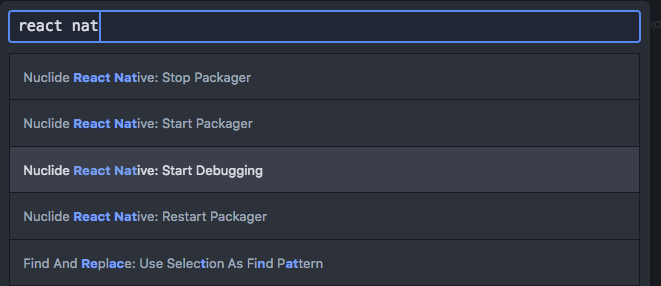
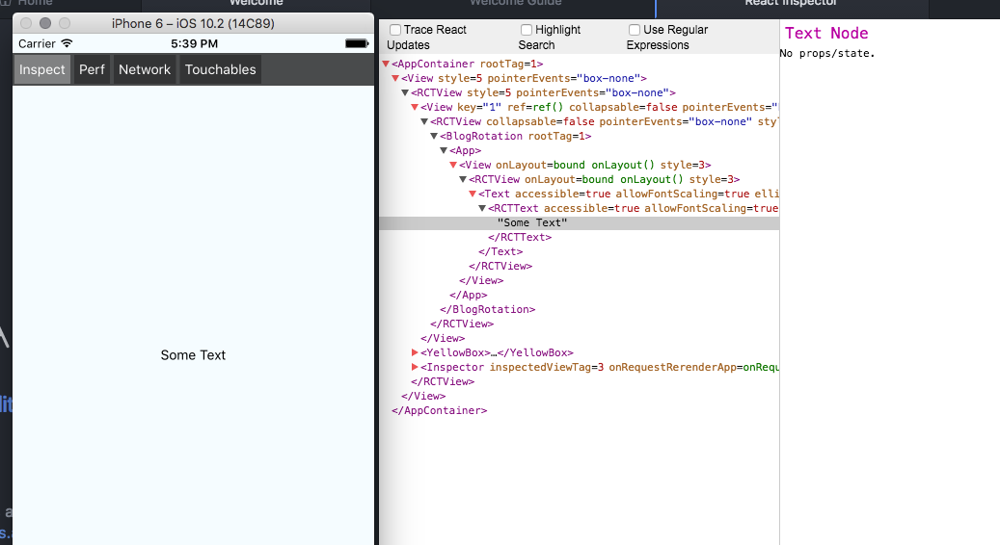

## Nuclide Reference Sheet
Nuclide is a package from Facebook, built on top of Atom, to provide an IDE like experience for React Native development.
##### Useful Nuclide/Atom Commands for MacOS:
* **Open Code Diagnostics Window:** Option + Shift + D
* **Open Project Explorer:** Cmd + \
* **Toggle Outline View (i.e. Reveal Class + Function Definitions):** Option + O
* **Flow, Automatically Insert Missing Require Statements:** Cmd + Shift + I

###### Diagnostic:
* **Fix All Possible Errors Detected by Nuclide:** Option + Shift + A
* **Go to First Diagnostics:**  Ctrl + Option + <
* **Go to Previous Diagnostic:** Option + <
* **Go to Next Diagnostic:** Option + >
* **Go to Last Diagnostic:** Ctrl + Option + >

###### Search:
* **Omni-search:** Cmd + T
* **Find Files Related to Current File:** Option +Cmd + N

###### Debugging:
* **Toggle the Console Panel:** Alt + Cmd + J
* **Toggle the Developer Tools UI:** Option + Cmd + I
* **Shows Process Attachment UI (e.g. Search  'Aday'):** Option + Cmd + I
* **Continue Debugging:** F8
* **Run to Location After Break:** Shift + F8
* **Restart the Current Debugging Session:** Cmd + Shift + F8
* **Toggle Breakpoint:** F9
* **Step Over:** F10
* **Step Into:** F11
* **Step Out after Step In:** Shift + F11

* **With markdown-preview, View Preview of this Readme:** Ctrl + Shift + m

###### Nuclide Element Inspector

* From the Command Palette (**cmd + shift + p**), choose Nuclide React Native Inspector

* The Element Inspector will open directly within Nuclide:

To view highlight elements in the simulator:
* Within the simulator, press Cmd-D and choose *Show Inspector*
